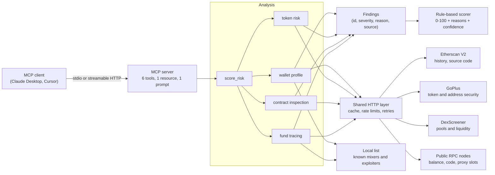

# web3-risk-mcp

[](https://github.com/MelvTheGoat/web3-risk-mcp/actions/workflows/ci.yml)


A fraud analyst for web3 that any AI assistant can use.

`web3-risk-mcp` is an **MCP server**: a small program that gives AI assistants
(Claude Desktop, Cursor, and other MCP clients) new tools. These tools check a
crypto wallet, token, or smart contract for risk **before** someone interacts
with it. It then gives a 0–100 risk score with a clear reason for every point.

> **MCP** (Model Context Protocol) is an open standard for connecting AI
> assistants to outside tools and data. Write a tool once, and every MCP
> client can use it.

---

## Contents

- [Why it matters](#why-it-matters)
- [Read-only by design](#read-only-by-design)
- [What it can do](#what-it-can-do)
- [How it works](#how-it-works)
- [Setup](#setup)
- [Connect it to Claude Desktop or Cursor](#connect-it-to-claude-desktop-or-cursor)
- [Example questions and outputs](#example-questions-and-outputs)
- [The risk score](#the-risk-score)
- [Evaluation](#evaluation)
- [Limitations](#limitations)
- [Development](#development)
- [Glossary](#glossary)

---

## Why it matters

Crypto scams are common, fast, and final. There is no bank to call and no
"undo" button. Common traps include:

- **Honeypot tokens**: you can buy them, but the contract stops you from selling.
- **Rug pulls**: the creator removes the trading money (the "liquidity") and the price goes to zero.
- **Hidden owner powers**: the owner can mint new tokens, freeze your wallet, or raise the sell fee to 100%.
- **Dirty money**: a wallet that received funds from a hack or a mixer.

People now ask AI assistants "is this token safe?" Without real data the
assistant can only guess. This server gives it real, on-chain evidence from
several sources, and a score it can explain line by line.

## Read-only by design

This is a safety feature, not a missing feature.

| The server never... | Why |
|---|---|
| asks for a private key or seed phrase | A key gives full control of a wallet. A risk checker has no reason to see one, so any tool that asks for one should be treated as a scam. |
| signs or sends transactions | Every check uses public, read-only data. There is no code path that can move funds. The RPC client even refuses any method outside a short read-only allow-list. |
| holds funds or approves spending | Nothing to steal, nothing to drain. |

Because of this, it is safe to hand the tools to an AI assistant. The worst a
confused assistant can do is read public data. Every tool is also marked with
the MCP `readOnlyHint`, so clients know it does not change anything.

## What it can do

| Tool | What it answers |
|---|---|
| `score_risk` | "How risky is this address?" Detects if it is a wallet, token, or contract, runs the right checks, and returns a 0–100 score with every point explained. |
| `get_wallet_profile` | Wallet age, balance, number of transactions sent, top counterparties, tokens used recently, activity patterns, who first funded it, and known bad-actor labels. |
| `check_token_risk` | Honeypot signs, mint, blacklist, and pause powers, buy and sell tax, owner and holder concentration, liquidity size, and whether liquidity is locked. |
| `inspect_contract` | Is the source verified? Is it an upgradeable proxy? Who controls it: a single wallet, a multisig, or nobody? Plus a plain-English summary of risky functions. Works on unverified contracts too, by scanning the bytecode. |
| `trace_funds` | Follows money in and out for 1 or 2 hops and flags links to mixers, sanctioned wallets, exploiters, and phishing addresses, with the full path. |
| `list_supported_chains` | The chains it supports. |

Also included:

- **Resource** `risk://scoring-method`: the full scoring rules, generated from the same rule table the scorer uses.
- **Prompt** `investigate_address`: a step-by-step investigation plan that tells the assistant which tools to call, what to look for, and how to explain the result to a beginner.

**Chains:** Ethereum, Base, Arbitrum One, Polygon PoS, and BNB Chain.

## How it works



A few design choices worth knowing:

- **One failing source never breaks an investigation.** Each call is wrapped.
  If GoPlus is down, you still get the Etherscan and DexScreener results, and
  the report lists what failed and why in `sources` and `data_gaps`.
- **Missing data lowers confidence, not the score.** A report never quietly
  treats "no data" as "safe".
- **Resilient HTTP.** Answers are cached (5 minutes by default). Each source
  has its own rate limit under the free-plan limits. Timeouts, HTTP 429, and
  server errors are retried with exponential backoff and jitter. API keys are
  removed from logs, cache keys, and error messages.
- **Findings, then scoring.** The analysis code only describes what it sees.
  A separate, pure scoring function turns findings into points. This keeps
  the score easy to test and easy to explain.

## Setup

You need Python 3.11+ and [uv](https://docs.astral.sh/uv/).

```bash
git clone https://github.com/MelvTheGoat/web3-risk-mcp.git
cd web3-risk-mcp
uv sync
cp .env.example .env    # then add your keys
```

### API keys (all free)

| Setting | Where to get it | Needed? |
|---|---|---|
| `ETHERSCAN_API_KEY` | [etherscan.io/myapikey](https://etherscan.io/myapikey). One key covers every chain through the V2 API. | Yes, for wallet history, source code, and tracing |
| `GOPLUS_APP_KEY`, `GOPLUS_APP_SECRET` | [gopluslabs.io](https://gopluslabs.io) developer dashboard | No. GoPlus works without a key, at lower limits. |
| `RPC_URL_<CHAIN>` | Any provider, for example Alchemy or Infura | No. Free public nodes are the default. |
| DexScreener | No key | – |

> **Note on Etherscan's free plan.** It no longer includes account history
> on Base and BNB Chain. On those chains the wallet and tracing tools still
> return balance and contract data from RPC, and they say that history is
> missing. Source-code lookups work on every chain.

Never commit your `.env` file. It is already in `.gitignore`.

### Run it

```bash
uv run web3-risk-mcp                                   # stdio (for local clients)
uv run web3-risk-mcp --transport http --port 8000      # streamable HTTP at /mcp
```

### Docker

```bash
docker build -t web3-risk-mcp .
docker run --rm -p 8000:8000 --env-file .env web3-risk-mcp        # HTTP on :8000/mcp
docker run -i --rm --env-file .env web3-risk-mcp --transport stdio # stdio
```

The image runs as a non-root user.

## Connect it to Claude Desktop or Cursor

### Claude Desktop

Open **Settings → Developer → Edit Config** and add this to
`claude_desktop_config.json`. Use the full path to your copy of the repo.

```json
{
  "mcpServers": {
    "web3-risk": {
      "command": "uv",
      "args": ["--directory", "/full/path/to/web3-risk-mcp", "run", "web3-risk-mcp"]
    }
  }
}
```

`--directory` makes the server start inside the repo, so it finds your `.env`.
Restart Claude Desktop. The tools appear under the tools icon, and the
`investigate_address` prompt appears in the prompt menu.

### Cursor

Add the same block to `~/.cursor/mcp.json` (all projects) or
`.cursor/mcp.json` (one project):

```json
{
  "mcpServers": {
    "web3-risk": {
      "command": "uv",
      "args": ["--directory", "/full/path/to/web3-risk-mcp", "run", "web3-risk-mcp"]
    }
  }
}
```

### Any client, over HTTP

Start the server with `--transport http` (or the Docker image) and point the
client at `http://localhost:8000/mcp`:

```json
{ "mcpServers": { "web3-risk": { "url": "http://localhost:8000/mcp" } } }
```

## Example questions and outputs

Things you can ask your assistant once the server is connected:

- "Is it safe to buy the token `0x…` on Base?"
- "Who controls the contract `0x…`? Can they change it?"
- "Where did the money in wallet `0x…` come from? Any links to mixers?"
- "Give me a risk score for `0x…` and explain every point."
- Or pick the **investigate_address** prompt and paste an address.

Below is real output from `score_risk` for a honeypot-style token. The data
comes from the test fixtures (`tests/test_token.py`), so the address is a
placeholder. The list is trimmed to the top 7 contributions.

```json
{
  "score": 100,
  "level": "critical",
  "verdict": "Very likely dangerous. Do not interact.",
  "confidence": "high",
  "address_type": "token",
  "contributions": [
    { "finding_id": "token.honeypot", "points": 60, "counted": true,
      "reason": "A test sale failed. Buyers of this token are likely unable to sell it.", "source": "GoPlus" },
    { "finding_id": "token.extreme_sell_tax", "points": 45, "counted": true,
      "reason": "Selling costs 99.0% of the amount. You would lose most of your money.", "source": "GoPlus" },
    { "finding_id": "token.not_open_source", "points": 25, "counted": true,
      "reason": "Nobody can read what this contract really does.", "source": "GoPlus" },
    { "finding_id": "token.mintable", "points": 15, "counted": true,
      "reason": "New tokens can be created, which dilutes holders.", "source": "GoPlus" },
    { "finding_id": "token.tax_modifiable", "points": 15, "counted": true,
      "reason": "The owner can raise the buy or sell tax at any time.", "source": "GoPlus" },
    { "finding_id": "token.blacklist", "points": 10, "counted": true,
      "reason": "The owner can block chosen wallets from selling or moving tokens.", "source": "GoPlus" },
    { "finding_id": "token.insider_holds_large_share", "points": 10, "counted": true,
      "reason": "The owner and creator together hold 30.0% of the supply.", "source": "GoPlus" }
  ],
  "points_added": 218,
  "points_removed": 0,
  "checks_run": ["check_token_risk", "inspect_contract", "address_labels"],
  "data_gaps": []
}
```

`inspect_contract` also writes a plain-English summary. For an unverified
contract owned by one wallet:

> This contract's source code is not published, so its behaviour is hidden.
> The function list below comes from a bytecode scan and may be incomplete.
> It is owned by a single wallet (0xdede…dede). Functions that could hurt
> users: it can create new tokens out of thin air, which dilutes every holder;
> can block chosen wallets from selling or moving tokens.

## The risk score

The score is **rule-based and fully explainable**. There is no machine
learning and no hidden weighting.

1. Each tool turns what it sees into **findings** with a stable ID, such as
   `token.honeypot` or `trace.direct.mixer`.
2. A public **rule table** gives each finding ID its points. Trust signals give
   negative points: for example `token.trusted` is −40 and `wallet.established` is −10.
3. Findings that describe the **same problem** share a group, and only the
   biggest in a group counts. For example, "source not verified" from GoPlus and
   from Etherscan count once.
4. The total is clamped to 0–100.
5. **Decisive findings** (honeypot, sanctioned address, known exploiter,
   phishing, fake token, and a few others) set a **floor of 75**, so trust
   signals can never hide them.

| Score | Level | Meaning |
|---|---|---|
| 75–100 | critical | Very likely dangerous. Do not interact. |
| 50–74 | high | Serious red flags. Avoid unless you fully understand the risks. |
| 20–49 | medium | Some warning signs. Look closely before interacting. |
| 0–19 | low | No major red flags in the data we could check. |

Each score also has a **confidence** (high, medium, or low) based on how many
data sources answered. Every contribution lists its points, its reason, its
source, and the rule that applied. The full rule table is in
[docs/risk-method.md](docs/risk-method.md), and clients can read it through the
`risk://scoring-method` resource. Both are generated from the code, and a test
fails if the document drifts.

## Evaluation

[`eval/dataset.json`](eval/dataset.json) has 34 hand-checked addresses, each
with a source for its label:

- **12 risky**: a honeypot token from a GoPlus case study, the SQUID rug pull,
  4 phishing wallets labelled by Etherscan and ScamSniffer, 4 exploiter
  wallets (Ronin, Bybit, Euler, Wormhole), and 2 Tornado Cash pools.
- **22 safe**: major tokens on all five chains (USDC, USDT, DAI, WETH, UNI,
  LINK, AAVE, WBTC, stETH, ARB, CAKE, and others), Uniswap and Aave contracts,
  vitalik.eth, and an exchange hot wallet.

[`eval/run_eval.py`](eval/run_eval.py) scores every item and reports ROC AUC,
precision, recall, false alarms, and missed items at a threshold of 50. It
runs **twice**. The second run switches off the local list of known bad
addresses. Six risky items are on that list, so the second run shows what the
other signals (GoPlus, contract analysis, behaviour) catch on their own. This
keeps the evaluation honest.

```bash
uv run python eval/run_eval.py --record   # live run, saves every API response
uv run python eval/run_eval.py --replay   # re-run offline from the saved responses
```

With `--record`, every response is saved to `eval/fixtures/cassette.json.gz`
(API keys are never stored). Anyone can then reproduce the exact numbers with
`--replay`, without keys or network access.

**Results:** _pending the first live run._ The results table will go here
and in [`eval/results.md`](eval/results.md).

## Limitations

- **Only as good as its sources.** A brand-new scam that GoPlus has not scanned
  and that is not on any list can score low. A low score is "no red flags
  found", not "safe".
- **Rule weights are hand-picked.** They follow common scam patterns and are
  checked by the evaluation set, but they are not a trained statistical model.
- **Sampled history.** Wallet profiles and fund tracing look at the latest
  100 transactions of each kind (50 for hop-2 addresses), and tracing follows
  the busiest paths only. Old or low-volume activity can be missed.
- **Bytecode scanning is a heuristic.** It finds known function signatures in
  unverified contracts. Renamed or custom functions can slip through.
- **Etherscan free plan.** No account history on Base or BNB Chain without a paid plan.
- **Small local list.** The built-in list of known bad addresses is short and
  hand-checked on purpose. GoPlus provides the broad coverage.
- **EVM only.** No Solana, Bitcoin, or other non-EVM chains.
- **Not financial advice.** This is a research tool. Always do your own checks.

## Development

```bash
uv sync                      # install everything, including dev tools
uv run pytest                # 100+ tests; all HTTP is mocked, no keys needed
uv run ruff check .          # lint
uv run ruff format .         # format
uv run python scripts/render_method_doc.py   # rebuild docs/risk-method.md after changing rules
```

CI runs lint, format checks, and tests on Python 3.11, 3.12, and 3.13, and
builds the Docker image on every push.

```
src/web3_risk_mcp/
├── server.py          MCP tools, resource, and prompt
├── __main__.py        command line (stdio or HTTP)
├── config.py          settings from .env
├── chains.py          supported chains and address checks
├── services.py        builds all API clients
├── clients/           Etherscan, GoPlus, DexScreener, RPC, and the shared HTTP layer
├── analysis/          wallet, token, contract, trace, and score logic
├── scoring.py         rule table and scoring function
├── method.py          builds the scoring-method document
├── prompts.py         investigate_address prompt text
├── labels.py          lookup for the local address list
├── evaluation.py      metrics and record/replay for the evaluation
└── data/known_addresses.json
```

## Glossary

- **Address**: an account on the blockchain, written as `0x` plus 40 hex characters. It can be a wallet or a contract.
- **Wallet (EOA)**: an address controlled by a private key held by a person.
- **Smart contract**: a program that lives on the blockchain at its own address.
- **Token (ERC-20)**: a coin created by a smart contract.
- **EVM**: the Ethereum Virtual Machine. EVM chains share the same address and contract format.
- **DEX / pool / liquidity**: a decentralized exchange is a contract where people trade tokens. A pool holds two tokens, and the money in it is its liquidity.
- **LP tokens / locked liquidity**: whoever holds a pool's LP tokens can withdraw its liquidity. Locking or burning them stops a rug pull.
- **Honeypot**: a token you can buy but cannot sell.
- **Proxy / upgradeable contract**: a contract whose logic can be swapped for new code by its admin.
- **Renounced**: the owner gave up control, so owner-only functions can no longer be used.
- **Multisig**: a wallet that needs several people to sign, which is safer than a single key.
- **Mixer**: a service that pools and mixes funds to hide where they came from.
- **Verified source**: the author published the source code and the block explorer confirmed it matches the code on chain.
- **Function selector**: a 4-byte fingerprint of a function's name and inputs, stored in the contract's bytecode.

## License

[MIT](LICENSE)
